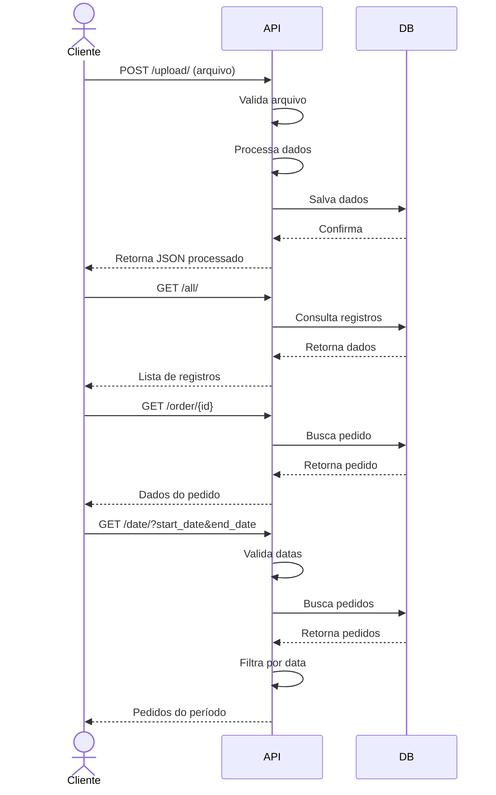

# API de Processamento de Pedidos

Este projeto é uma API REST desenvolvida em Django que recebe arquivos de pedidos desnormalizados, faz a trativa e retorna formato JSON normalizado.

## Escolha da tecnologia
A escolha pelo fastapi é a facilidade de ser uma api escalavel e a simplicidade do projeto para o desenvolvimento de uma api.  

## Funcionalidades

- Upload de arquivo de pedidos desnormalizados
- Listagem de pedidos
- Busca de pedido por ID
- Busca de pedidos por período de data

## Requisitos

- Python 3.10+
- FastAPI 0.100+
- SQLAlchemy 2.0+

## Passo a passo para instalar o projeto

1. Clone o repositório:
```bash
https://github.com/WesleyHs/api_desafio.git
cd api_desafio_2
```

2. Crie e ative uma venv ou ambiente virtual:
```bash
python -m venv .venv
source .venv/bin/activate  # Linux/Mac
# ou
.venv\Scripts\activate  # Windows
```

3. instala os pacotes e dependencias:
```bash
pip install -r requirements.txt
```

4. Inicie o servidor:
```bash
fastapi run 
```


## Endpoints da API

### 1. Upload de Arquivo
- **URL**: `/upload/`
- **Método**: POST
- **Descrição**: Recebe um arquivo desnormalizado e faz a tratativa

### 2. Listar Todos os Pedidos
- **URL**: `/all/`
- **Método**: GET
- **Descrição**: Retorna todos os pedidos.

### 3. Buscar Pedido por ID
- **URL**: `/order/{order_id}`
- **Método**: GET
- **Descrição**: Retorna os detalhes de um pedido específico

### 4. Buscar Pedidos por Data
- **URL**: `/date/`
- **Método**: GET
- **Parâmetros**:
  - `start_date`: Data inicial (formato YYYYMMDD)
  - `end_date`: Data final (formato YYYYMMDD)
- **Descrição**: Retorna pedidos dentro do período especificado

## Exemplo de Uso
```
http://localhost:8000/docs/ - Acesse após iniciar o servidor para visualizar a documentação API
```


